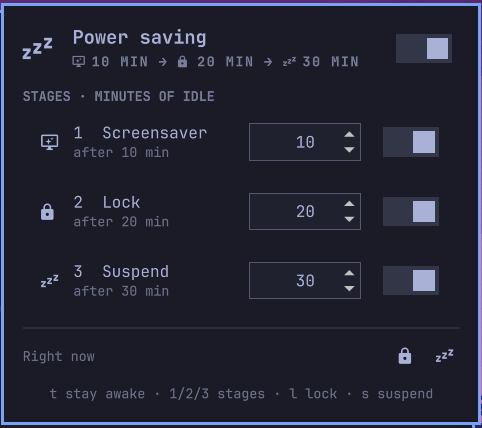

# Omarchy Power Saving

Idle power saving for [Omarchy](https://omarchy.org) in four independent
stages, grouped the way you think about them:

- **Display** — **screensaver**, then **standby** (monitors off).
- **System** — **lock**, then **sleep** (suspend).

Each stage has its own on/off switch and its own idle timeout, set from a bar
panel.

Omarchy's stock idle service only knows screensaver + lock, cannot switch
either off individually, never puts the monitors into standby and never
suspends. This plugin replaces it.

## Install

```bash
omarchy plugin add https://github.com/selfcrypto/omarchy-power-saving.git --enable
```

That is the whole installation. Enabling this plugin disables the stock
`omarchy.idle` service for you (it is the service this one replaces — leaving
both on would lock and launch the screensaver twice) and says so in a
notification. Nothing else is touched: your existing `idle.screensaver` /
`idle.lock` values in `shell.json` keep their meaning.

If you re-enable `omarchy.idle` by hand later, this plugin steps aside and
pauses itself instead of fighting you for the setting; the panel and a
notification say so.

Verify:

```bash
omarchy plugin list
omarchy-shell idle status
```

Update:

```bash
omarchy plugin update io.github.selfcrypto.power-saving
```

Remove (restores the stock service):

```bash
omarchy plugin remove io.github.selfcrypto.power-saving && omarchy plugin enable omarchy.idle
```

## Who it's for

- **Desktop PCs** first of all. A desktop has no lid switch, and stock Omarchy
  has neither an idle-standby nor an idle-suspend stage, so the monitors stay
  lit and the machine never sleeps. This plugin gives it both.
- **Laptops left open.** Closing the lid already suspends (that's logind, not
  this plugin), but a laptop sitting open on a desk never blanks its panel or
  suspends on idle in stock Omarchy either — and there it costs battery. The
  per-stage switches ("screensaver but no lock at home") are useful on any
  machine.
- Not yet: separate timeouts for battery and mains. One set of timeouts
  applies whatever the power source.

## Preview



## Features

- Four stages — screensaver, standby, lock, sleep — each with a switch and a
  timeout in minutes of idle.
- **Monitor standby that Omarchy does not otherwise have.** The lock screen's
  "blank" is `omarchy-brightness-display off`, which is backlight/DDC
  brightness on one monitor, not standby; this stage drives Hyprland's DPMS
  dispatcher, so the monitors actually power down.
- Standby and sleep have an idle monitor each: both respect idle inhibitors (a
  playing video keeps the screens on) and both survive the lock.
- "Stay awake" pauses all four stages; it is the same flag as
  `omarchy toggle idle` and the coffee-cup indicator.
- The screensaver switch is Omarchy's own `screensaver-off` toggle, so the
  Omarchy menu and the panel always agree.
- Numpad-safe minutes fields and one settings write per edit.
- Full IPC control.

## Usage

- **Left-click** the bar icon: open the panel.
- **Right-click**: toggle *stay awake*.
- In the panel, each stage row has a minutes field and a switch. Keys:
  `t` stay awake, `1`–`4` toggle a stage, `o` standby now, `k` lock now,
  `s` sleep now.

Monitors come back on a key press or a mouse move (Omarchy ships
`misc.key_press_enables_dpms` and `misc.mouse_move_enables_dpms` on), and this
service switches them back on explicitly when it sees activity, when standby is
switched off with the screens already dark, and before suspending — a resume
never lands on a black desktop.

Sleep always locks first, through the same `omarchy-system-lock` the lock
stage uses, so a running screensaver is closed before the machine sleeps and
it wakes to the lock screen, not to a screensaver behind the unlocked desktop.
(Omarchy's own `omarchy-sleep-lock.service` locks on `PrepareForSleep` as well,
whatever the lock stage says.)

## Configuration

Everything lives in the `idle` block of `~/.config/omarchy/shell.json` and is
written by the panel; the stock keys keep their stock meaning.

```json
"idle": {
  "screensaver": 300,
  "standby": 600,
  "lock": 1200,
  "suspend": 1800,
  "lockEnabled": false,
  "standbyEnabled": true,
  "suspendEnabled": true
}
```

| Key | Meaning | Default |
|---|---|---|
| `screensaver`, `standby`, `lock`, `suspend` | seconds of idle before the stage fires | 150, 600, 300, 1800 |
| `lockEnabled` | lock stage on/off | `true` |
| `standbyEnabled` | standby stage on/off | `false` |
| `suspendEnabled` | sleep stage on/off | `false` |

The sleep stage keeps the stock `suspend` key, so nothing else in Omarchy has
to learn a new name. The screensaver switch is the flag file
`~/.local/state/omarchy/toggles/screensaver-off` (`omarchy toggle screensaver`).

## IPC

The IPC target is `idle`, the same as the stock service, so existing calls
keep working.

```bash
omarchy-shell idle status                       # JSON: stages, monitors, last event
omarchy-shell idle stage standby on             # on | off | toggle | status
omarchy-shell idle timeout standby 900          # seconds (min 10)
omarchy-shell idle timeout standby ""           # print the current value
omarchy-shell idle standby                      # standby (monitors off) now
omarchy-shell idle wake                         # monitors on now
omarchy-shell idle suspend                      # sleep now
omarchy-shell idle enable | disable | toggle    # stay-awake, as upstream
```

Stage names for `stage` and `timeout`: `screensaver`, `standby`, `lock`,
`suspend`.

## Requirements and dependencies

- Omarchy with the Quickshell shell (`omarchy-shell`); no extra packages.
- Hyprland ≥ 0.56 for the standby stage: it drives DPMS through the Lua
  dispatcher, `hyprctl eval 'hl.dispatch(hl.dsp.dpms({action = "off"}))'`
  (the older `hyprctl dispatch dpms off` no longer parses there).
- Sleep asks logind directly (the `org.freedesktop.login1` `Suspend` call,
  the same one Omarchy's own Suspend menu entry makes), so it needs no
  privileges and is refused while a sleep inhibitor is held.
- No external services. No privileges beyond the user session.

## Notes

- Monitors are never reconfigured, only created and destroyed: Quickshell
  0.3.1 silently breaks an `IdleMonitor` whose timeout changes at runtime.
- Screensaver and lock share one idle monitor, as the stock service does;
  standby and sleep have one each, so they still fire after the lock.
- The DPMS action has to be passed as `{action = "off"}`. `hl.dsp.dpms("off")`
  builds a perfectly valid dispatcher, and every other shape tried does too —
  but the argument is then ignored and the dispatch *toggles*, which turns a
  wake into a blank. `hyprctl monitors` is no help in spotting it either: its
  `dpmsStatus` lags a dispatch behind. `/sys/class/drm/*/dpms` is the honest
  read.
- Standby leaves a running screensaver alone: a monitor in DPMS off gets no
  frames, so its client throttles itself, and killing it would look like you
  dismissed it and would cancel the pending lock.
- While this plugin replaces `omarchy.idle`, the stock coffee-cup indicator in
  `omarchy.indicators` does nothing (it looks the service up by the stock id);
  use this widget's right-click instead.

## License

MIT — see [LICENSE](LICENSE).
