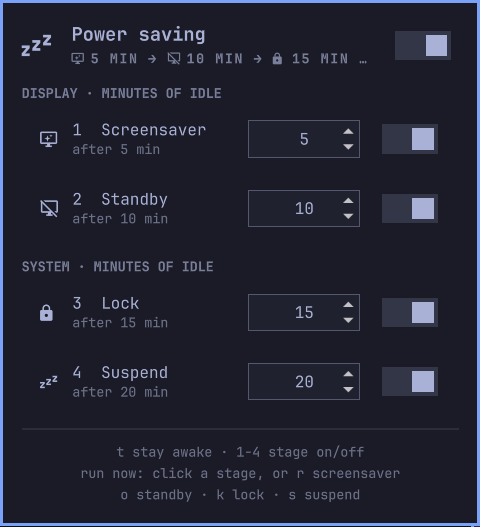

# Omarchy Power Saving

Idle power saving for [Omarchy](https://omarchy.org) in four stages:

| Group | Stage | What it does |
|---|---|---|
| Display | Screensaver | Starts the Omarchy terminal screensaver |
| Display | Standby | Turns the monitors off (DPMS) |
| System | Lock | Locks the session |
| System | Suspend | Suspends the machine |

Each stage has its own switch and its own idle timeout. Both are set from a
panel in the bar.

The stock Omarchy idle service only has screensaver and lock. It cannot switch
either of them off, it never turns the monitors off and it never suspends.
This plugin replaces it.

## Preview



## Install

```bash
omarchy plugin add https://github.com/selfcrypto/omarchy-power-saving.git --enable
```

Nothing else is needed. The plugin is declared as a clone of the stock
`omarchy.idle` service, so Omarchy switches the stock service off when this
plugin is enabled and back on when it is removed. Running both would lock and
start the screensaver twice.

The `idle.screensaver` and `idle.lock` values you already have in `shell.json`
are used as the starting timeouts.

If you enable `omarchy.idle` again by hand, Omarchy takes this plugin out of
the bar, as it does with any other clone.

Check that it is running:

```bash
omarchy plugin list
omarchy-shell idle status
```

Update:

```bash
omarchy plugin update io.github.selfcrypto.power-saving
omarchy restart shell
```

Remove:

```bash
omarchy plugin remove io.github.selfcrypto.power-saving
```

The stock service comes back by itself. If the plugin was installed before
1.3.0, also run `omarchy plugin enable omarchy.idle`.

## Who it is for

- Desktop PCs. A desktop has no lid, and stock Omarchy has no idle standby and
  no idle suspend, so the monitors stay on and the machine never suspends.
- Laptops left open. Closing the lid suspends (logind does that, this plugin
  is not involved), but an open laptop never turns its screen off or suspends
  on idle in stock Omarchy.
- Anyone who wants to switch single stages off, for example screensaver
  without lock at home.

There is one set of timeouts. Separate timeouts for battery and mains are not
supported yet.

## Usage

Bar icon:

- Left click opens the panel.
- Right click toggles stay awake, which pauses all four stages. It is the same
  flag as `omarchy toggle idle` and the coffee cup indicator.

Panel:

- Each stage row has a minutes field and a switch.
- Clicking the icon or the name of a stage runs that stage immediately.
- The switch at the top toggles stay awake.

Keys in the panel:

| Key | Action |
|---|---|
| `t` | Toggle stay awake |
| `1` to `4` | Switch a stage on or off |
| `r` | Screensaver now |
| `o` | Standby now |
| `k` | Lock now |
| `s` | Suspend now |

Running a stage by hand works even when its switch is off.

## Behaviour

Screensaver:

- A mouse move ends it, as well as a key press. The stock screensaver only
  reacts to keys. Mouse dismissal starts working about 2.5 seconds after the
  screensaver appears.
- Ending the screensaver counts as activity, so a pending lock is cancelled
  and the idle count starts again.
- The switch is Omarchy's own `screensaver-off` toggle, so the Omarchy menu
  and the panel always show the same state.
- It is not started while the monitors are off.

Standby:

- The monitors are turned off through Hyprland's DPMS dispatcher. The lock
  screen "blank" in stock Omarchy only lowers the brightness of one monitor.
- A key press or a mouse move turns them back on.
- A running screensaver is closed first. This does not count as activity, so
  the lock still fires on time.
- Idle inhibitors are respected. A playing video keeps the monitors on.

Lock:

- Uses `omarchy-system-lock`, the same as the stock service.

Suspend:

- Locks the session first, so the machine wakes to the lock screen.
- Turns the monitors back on before suspending, so a resume does not show a
  black screen.
- Goes through logind, needs no privileges and is refused while a sleep
  inhibitor is held.
- Idle inhibitors are respected.

All four timeouts count from the moment you went idle. Starting the
screensaver or locking does not push the later stages back.

## Configuration

The settings are stored on this plugin's entry in the bar layout of
`~/.config/omarchy/shell.json`. The panel writes them, and so does
`omarchy bar set`:

```bash
omarchy bar set io.github.selfcrypto.power-saving suspend 1800
omarchy bar set io.github.selfcrypto.power-saving suspendEnabled true
```

```json
{
  "id": "io.github.selfcrypto.power-saving",
  "screensaver": 300,
  "standby": 600,
  "lock": 1200,
  "suspend": 1800,
  "lockEnabled": false,
  "standbyEnabled": true,
  "suspendEnabled": true
}
```

| Key | Meaning | Default |
|---|---|---|
| `screensaver` | Seconds of idle before the screensaver starts | 150 |
| `standby` | Seconds of idle before the monitors turn off | 600 |
| `lock` | Seconds of idle before the session locks | 300 |
| `suspend` | Seconds of idle before the machine suspends | 1800 |
| `standbyEnabled` | Standby stage on or off | `false` |
| `lockEnabled` | Lock stage on or off | `true` |
| `suspendEnabled` | Suspend stage on or off | `false` |

The minimum timeout is 10 seconds.

A key that is missing from the entry is read from the stock `idle` block of
`shell.json`. The first edit from the panel copies all keys onto the entry.
The `idle` block is only read, never written, because since Omarchy 4.0.3 a
third-party plugin can only write its own bar entry.

The screensaver switch is not in `shell.json`. It is the flag file
`~/.local/state/omarchy/toggles/screensaver-off`, which
`omarchy toggle screensaver` also writes.

## IPC

The IPC target is `idle`, the same as the stock service, so existing calls
keep working.

```bash
omarchy-shell idle status                       # JSON: stages, monitors, last event
omarchy-shell idle stage standby on             # on | off | toggle | status
omarchy-shell idle timeout standby 900          # set, in seconds
omarchy-shell idle timeout standby ""           # print the current value
omarchy-shell idle screensaver                  # screensaver now
omarchy-shell idle standby                      # monitors off now
omarchy-shell idle wake                         # monitors on now
omarchy-shell idle suspend                      # suspend now
omarchy-shell idle enable | disable | toggle    # stay awake, as in the stock service
```

Stage names for `stage` and `timeout` are `screensaver`, `standby`, `lock` and
`suspend`.

## Requirements

- Omarchy 4.0.3 or later.
- Hyprland 0.56 or later for the standby stage.
- No extra packages, no external services and no privileges beyond the user
  session.

## Technical notes

- Idle monitors are created and destroyed, never reconfigured. Quickshell
  0.3.1 breaks an `IdleMonitor` whose timeout changes at runtime.
- Screensaver and lock share one idle monitor, as in the stock service.
  Standby and suspend have one each.
- The idle monitors only tell the service when you went idle. From then on
  the stages run on timers counted from that moment. Hyprland resets every
  idle monitor when the screensaver opens or closes and when the lock screen
  comes up, so monitors alone would delay the later stages.
- Activity reported while the service starts or closes the screensaver,
  locks or turns the monitors off, and for 2.5 seconds after, is taken to be
  that action and is ignored.
- Your return is detected by a fourth idle monitor with a 1 second timeout
  that ignores idle inhibitors. It is armed while you are away and while a
  screensaver is up. This is also what ends the screensaver on a mouse move.
- Standby calls
  `hyprctl eval 'hl.dispatch(hl.dsp.dpms({action = "off"}))'`. The older
  `hyprctl dispatch dpms off` no longer parses on Hyprland 0.56. The action
  has to be passed as `{action = "off"}`. With `hl.dsp.dpms("off")` the
  argument is ignored and the dispatch toggles.
- `hyprctl monitors` reports `dpmsStatus` one dispatch late. The service reads
  `/sys/class/drm/*/dpms` instead.
- The screensaver is kept off dark monitors because a DisplayPort monitor in
  DPMS off can drop its link. Hyprland then removes the monitor, and a
  screensaver window that survives this comes back drawn over the whole
  monitor while clicks go through to the desktop.
- The screensaver is closed before the DPMS off. Its exit restores the cursor
  through a Hyprland config keyword, and that makes Hyprland turn the
  monitors back on.
- Omarchy's `omarchy-sleep-lock.service` also locks on suspend, whatever the
  lock stage is set to.
- The stock coffee cup indicator in `omarchy.indicators` follows this plugin,
  because Omarchy resolves the stock id to the enabled clone.
- The service reads `shell.json` itself and does not use the `barConfig`
  snapshot the host passes to plugins. In 4.0.3 that snapshot is refreshed
  one config event late.

## License

MIT. See [LICENSE](LICENSE).
